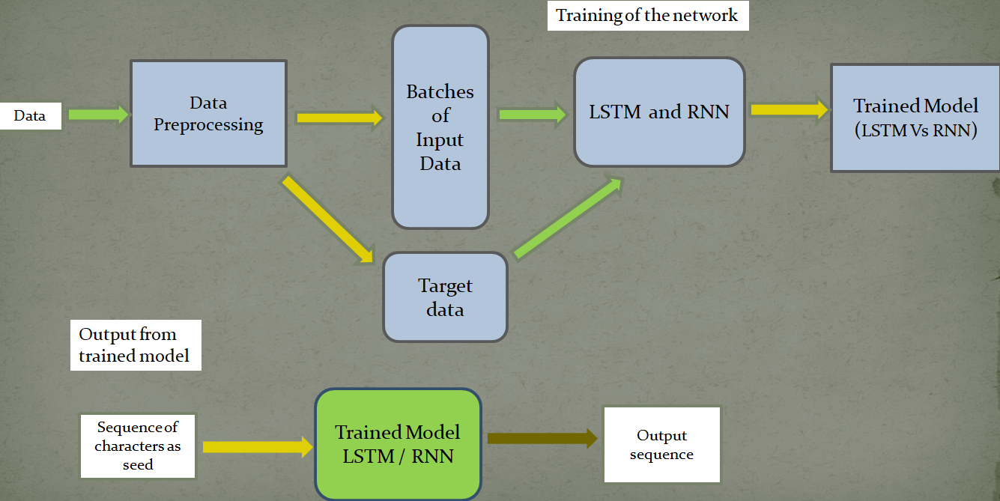
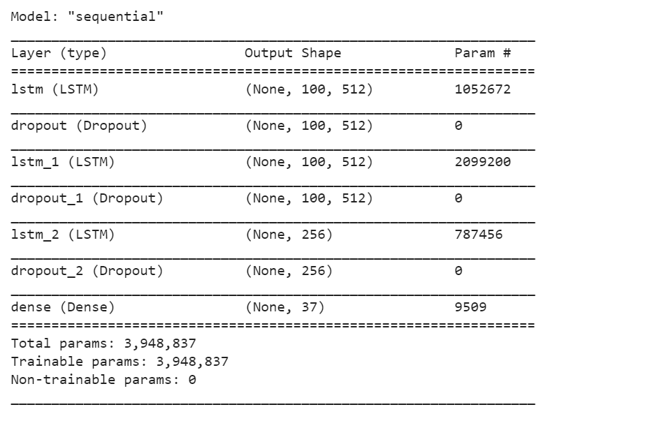

# Automatic-Text-Generator

This is an automatic text generator which is trained using LSTM architecture. The model is trained on the book named ' The Yellow Wallpaper ' by Charlotte Perkins Gilman. The book is selected from Project Gutenberg, which is a collection of more than 60k ebooks. So at first the model will take an input sentence from the user and then the user have to specify the maximum number of characters to predict, then this information will be fetched to the model and output will be generated.

## Workflow

 
 
 
 ## Model Architecture
 
 
 Fig : LSTM Architecture
 
 ## Tech Stacks
 
 #### **Tools**

- Python
- NLTK
- Tensorflow
- Numpy
- Streamlit
 
 
 ## Deployment
 Currently this is deployed using streamlit.
 Link to webapp : https://share.streamlit.io/borahb/automatic-text-generator/main/app.py
 
 ## License

- **[MIT license](http://opensource.org/licenses/mit-license.php)**
 
